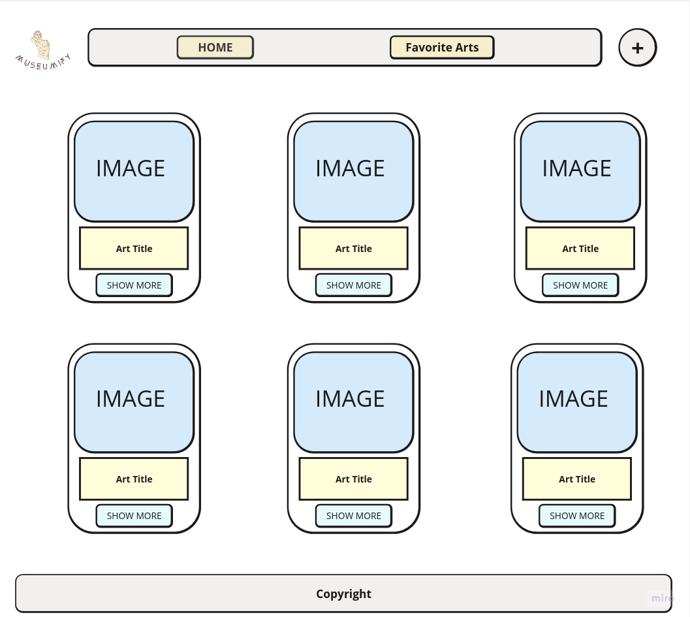
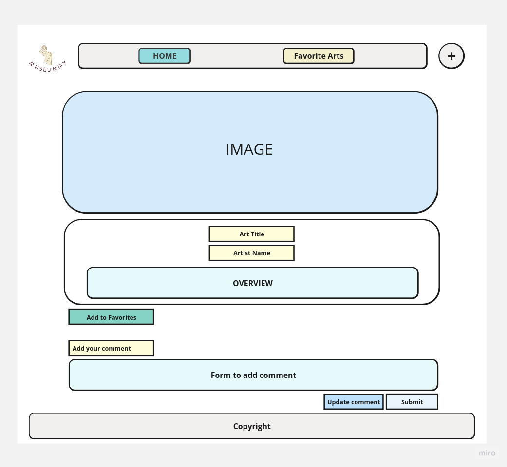
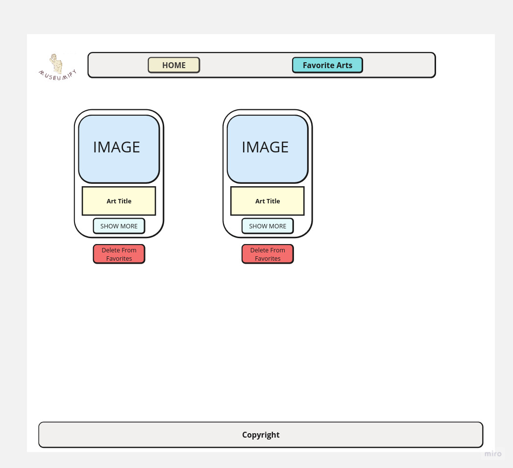

# 1-Project Idea

- # Identify the problem your web app will solve or the need it will fulfill

  We will represent a web application dedicated to showcasing arts in exhibitions and museums in the form of cards, where each card contains specific information about an art piece. Users will be able to navigate and browse through these cards to enjoy learning about different arts and museums. They can also use it as a source of inspiration to plan future visits to these museums.

 The problem that our web app will solve is the difficulty for art enthusiasts and individuals interested in museums to access and explore comprehensive information about various art pieces and exhibitions from different museums around the world. Currently, gathering such information often involves visiting multiple websites or relying on fragmented sources, which can be time-consuming and overwhelming.

  Additionally, the app will address the need for credible and reliable information about art pieces and museums. By fetching data from specific APIs and using trusted sources, the app ensures that the information presented to users is accurate and credible, eliminating concerns about the reliability of the data.

  In summary, the web app will solve the problem of scattered and challenging access to information about arts and exhibitions while fulfilling the need for a centralized, user-friendly, and credible platform that allows users to explore and appreciate arts from diverse museums worldwide in one place. Also, to inspire people to embark on exciting and enriching journeys to these museums and exhibitions.

- # Explain how your web app will be useful

- A web application dedicated to showcasing arts in exhibitions and museums in the form of cards, where each card contains specific information about an art piece. Users will be able to navigate and browse through these cards to enjoy learning about different arts and museums. (They can also use it as a source of inspiration to plan future visits to these museums.)

- The data will be fetched from specific APIs that provide reliable information. The displayed data will rely on these trusted sources, ensuring the credibility of the information presented.

- The main objective is to transform this idea into a practical and useful application for art enthusiasts. The app aims to serve as a valuable resource for users seeking to explore and appreciate art exhibitions and museums worldwide, thus promoting art and cultural awareness among people.

- By the end of the presentation, the project hopes to gather multiple museums in one place and to inspire people to embark on exciting and enriching journeys to these museums and exhibitions.

# 2-FEATURES

- Our website offers plenty of features, including:
  - Showcasing users' own art pieces.
  - Browsing through a diverse collection of artwork from a reliable third-party API.
  - Highly interactive platform with the following functionalities:
    - Adding, updating, and deleting comments.
    - Displaying and adding favorite pieces to a personalized favorite collection page.

# - API URL

- (<https://collectionapi.metmuseum.org/public/collection/v1/objects>)

# - trello App

- <https://trello.com/b/XCmiJztN/museumifyboard>

# Wire Frames

- Home

- Art Details

- Favorite Page

